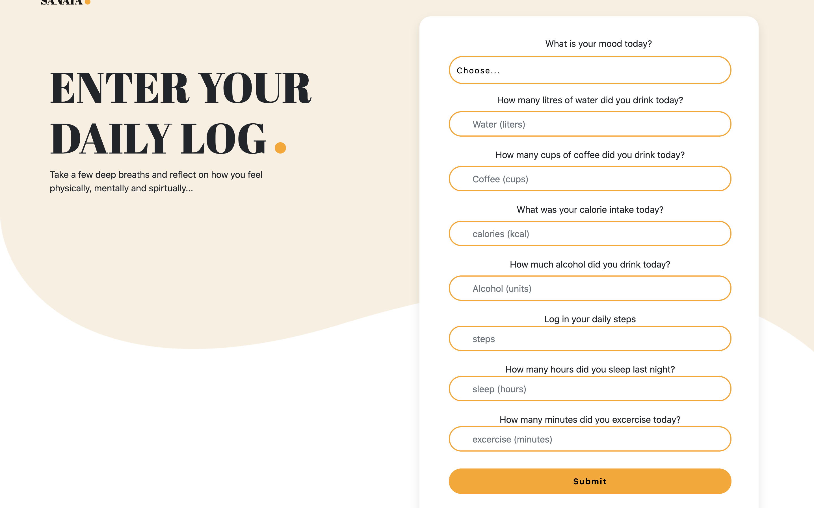

 

# Sanaya - The Daily Journalling Mindfulness App

## Description
Sanaya is a fullstack CRUD application built with node.js, sequelize and express handlebars. 

The application allows the user to login with thier email and name and navigate through the site, input their daily health and mood stats, recieve a random affirmation, upload and store images and view thier current and previous history log for each health and mood metric. It also allows the user to delete their records, both on the database and local storage.

Sanaya was developed by a team of three University of Birmingham Coding Bootcampt students, [Sandy Bassi](https://github.com/rubybassi), [Renato Pombal](https://github.com/Ard847) and [Sumaya Hassan](https://github.com/Sumaya198), as part of a group project to demonstrate a fully functioning CRUD application using MVC principles and utilising linitng and continuous intergration. It was conceived from a simple idea to create a space for busy individuals to take a moment for themselves, and track their behaviour in a quick and effortless way as part of their daily mindfulness practice.

### User Story

> As a **health conscious individual**, I want to **track and log my daily health behaviour** so that **I can develop a better quality of lifee**.

## Table of Contents
- [Preview](#Preview)
- [Execute](#Execute)
- [Contributing](#Contributing)
- [Test](#Test)
- [Future-Development](#Future-Development)
- [License](#License)
- [Environment](#Environment)
- [Questions](#Questions)

## Preview

> Watch a full demo video on [YouTube](https://youtu.be/pIYQghsyc0o)

> Visit the deployed application on [Heroku](https://mysanaya.herokuapp.com/).

#### Daily Log page

#### Affirmation page

## Execute
Clone the repo and in the command line run `npm install` or shortcut `npm i` to download all the npm package dependancies which include: Node Express, Nanoid, express-fileupload, express-handlebars, file-type, mysql2
node-fetch and sequelize.

Then invoke the application with command `node server.js` or by using the nodemon script `npm run dev`.

## Contributing
Contributions are welcomed.

## Test
The project follows a continuous intergration: from planning using agile methodology and wireframing, team collaboration on the build with git and github, testing with esLint and Travis CI, finally to deplayment on Heroku, then iterating back to planning on so on.

## Future Development
* Implement user Authentication with middleware such as Passport, Google Auth Node or similar.
* Incorporate a blog system allowing users to search and save articles by topics and themes. 
* Add additional features such as a favourites button for saving affirmations, a meditation sound timer and displaying daily stats against recommended metrics to show if met or not.

## License
MIT

## Environment
* [Visual Studio Code](https://code.visualstudio.com/)
* [Git](https://git-scm.com/book/en/v2/Getting-Started-Installing-Git)
* [Node.js](https://nodejs.org/en/)
* [NPM](https://www.npmjs.com/)
* [Express](https://www.npmjs.com/package/express)
* [nanoid npm package](https://www.npmjs.com/package/nanoid)
* [nodemon npm package](https://www.npmjs.com/package/nodemon)
* [Postman](https://www.postman.com/)
* [Heroku](https://www.heroku.com/)
* [Travis CI](https://travis-ci.org/)
* [JAWsDB](https://elements.heroku.com/addons/jawsdb)
* [MySql Workbench](https://www.mysql.com/products/workbench/)
* [Sequlaize ORM](https://sequelize.org/)
